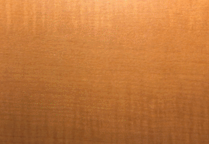

# carcassonne
A computer vision system to track games of Carcassonne. Built with Python and OpenCV

**Pardon the code mess, this is not an example of what I consider clean, production-ready code! Hoping I can take the time to improve this system and clean up the code base at the same time.**

This was my final project for [Stanford's CS231A: Computer Vision, From 3D Reconstruction to Recognition](http://web.stanford.edu/class/cs231a/).

Carcassonne is a turn based board game in which players take turns laying down tiles in a grid pattern.

## Demo

## Quick technical overview

This system is split into two modules:
1. recognition module
2. tracking module.

The recognition module uses a combination of Canny Edge Detector, Hough Transform, and RANSAC to fit a projective grid onto the scene and uses a template matching based approach to classify tiles.
The tracking module uses the recognition module to translate scene changes into actual moves in the game. It also leverages its understanding of the game to make recognition easier by providing known constraints to the recognition module.

## Interesting files
If you're trying to look at the code, some interesting files are:

[tracker.py - The high level tracking module that turns recognition data into an actual game](code/tracker.py)

[find_intersections.py - Finds corners of tiles using voting scheme](code/find_intersections.py)

[game.py - Contains all the game logic, provides the constraints for recongition module](code/game.py)

Again, I apologize for the littered print statements and sometimes unused variables. Some cleanup is definitely in order!

## More Info
You can read more about the specifics of this system in [report.pdf](report.pdf) contained in this repo.
